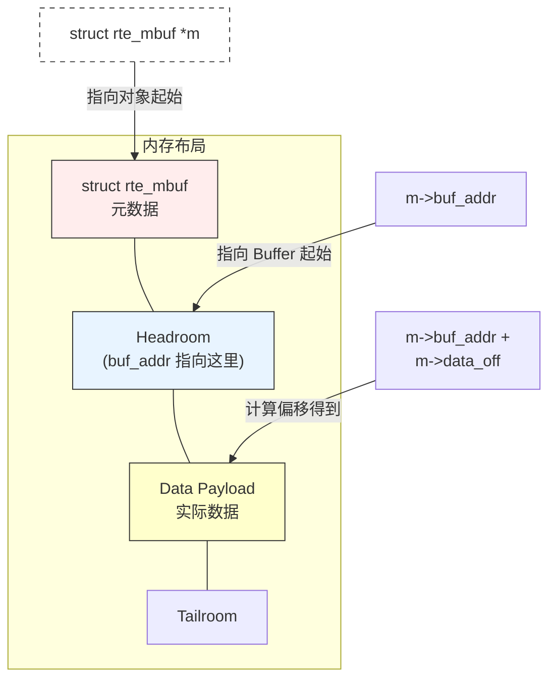

DPDK的内存有两个概念，`ret_mbuf`和对应的`rte_mempool`


# Mempool与Linux的普通内存池对比
DPDK内存池的设计是高性能的核心因素之一。 
`rte_mempool` 本质上是一个 **基于大页内存的、支持多核无锁访问的、固定大小的对象缓冲池**。
关于Linux的内存设计，可以参考[[Linux的内存管理]]。
Mbuf的核心 API 不是 `malloc/free`，而是：
- `rte_mempool_get()`: 拿一个对象（通常先从 Local Cache 拿）。
- `rte_mempool_put()`: 还一个对象。
## 物理层：Hugepages 对比 4KB页
这是基础上的区别。
- 普通内存采用4KB页。现在的内存动辄32GB，如果全用4KB页管理。TLB Miss概率会较高。
- DPDK的Mempool基于Hugepages（2MB/1GB）。需要的页表项极少，几乎不会TLB Miss。DPDK尽量保证对象在物理内存上是连续的。

## 结构层：固定大小对象池 对比 堆
- 普通内存（malloc）是在Heap上分配内存。
	- 可以申请灵活尺寸的内存空间，例如10字节，或是1MB。
	- 内存可能会变得更加碎片化。分配器需要采用算法来寻找合适的空间块，时间复杂度是不确定的。（所以实时操作系统普遍不支持动态申请内存）
- DPDK Mempool：
	- 这是一个**对象池**。意思是：创建池子时，必须指定每个元素的大小。例如每个元素都是2KB的`rte_mbuf`。
	- 分配和释放的时间复杂度都是严格为$O(1)$。不需要寻找空块，所有块都一样的，拿一个就可以。

## 并发层：Per-Core Cache 对比 锁竞争
这是DPDK性能碾压`malloc`最关键的原因。
- 普通内存：
	- 当多个线程同时调用`malloc`时，为了防止同一块内存分别被两个人拿走，必须加锁。
	- Lock Contention在多核高并发下，线程都在排队等锁，性能急剧下降。
- DPDK Mempool：
	- 采用Ring + Local Cache结构。
	- Local Cache：每个CPU核心都有自己私有的一小块内存块（Lcore Cache）。分配和释放都是优先对自己的私有缓存操作，**完全不需要锁**。              
	- 只有Local Cache空了或者满了，才回去访问公共的Ring（此时需要锁或者CAS原子操作）。
	- 绝大多数情况下，内存分配是**无锁**、**零竞争**的。

## 硬件亲和：Cache Alignment & Padding
- 普通内存：
	- 只要地址对齐（64位的8字节对齐）就行。
	- 多核变成中常见的陷阱：可能会存在**False Sharing（伪共享）**。如果两个变量太近，处于同一个（Cache Line）。两个不同的核心分别修改这两个相近变量，则会频繁导致对方Cache失效。
- DPDK Mempool
	- 强制对象首地址对齐到Cache Line（通常是64字节）的起始位置。
	- 在对象之间进行Padding，确保一个对象独占Cache Line，或者通过Channel padding让不同通道的内存分布在不同的内存通道上。
	- 这样可以确保让硬件的每一个时钟周期都在运行，确保CPU读写内存时效率最高。

# Mbuf结构设计

## 为什么需要rte_mbuff来替代sk_buff？
Linux内核的`sk_buff`很强大，但太重量级了：结构体庞大、跨越多个Cache Line、频繁的内存分配与释放。
DPDK为此需要实现一个更轻、更**紧凑**、对**CPU缓存更友好**的数据结构。这就是Mbuf。它是DPDK数据平面的**原子单位**。

Mbuf则是DPDK Mempool中的具体的一个单元。
```C
struct rte_mbuf *m = rte_pktmbuf_alloc(my_mempool);
```
- Mempool是负责内存的分配。解决“快不快”的问题。
- Mbuf负责数据的承载，解决“存什么”的问题。

**Mbuf是复用的**，而不是每次都要`malloc`。也不需要每次都`free`的
## 内存布局
内存布的核心思想就是：**移动指针永远比移动数据快**。

内存布局采用了三明治结构

rte_mbuf元数据 + headroom + data 都处于同一块连续的内存上。
为了体现出设计的目的性，这里我们依然可以与Linux下的常规设计（`sk_buff`）进行对比。

-  **普通做法**：
在普通网络编程中，要加一个头，是申请一块更大的内存，把数据拷贝过去，再在前面写上头。操作时间复杂度是$O(N)$。

- **DPDK做法**：
DPDK直接预先留出了一大片Headroom。
- 初始时`data_off`为128，即指向`buf_addr`后的128处内存空间。将之前的内存地址留为Headroom。
- **Prepend**：
	- 需要加14字节的以太网头。只需要将`data_off`减去14。这样就预留出了新空地来写入14字节的以太网头。
- **Strip**：
	- 需要去掉14字节的头，只需要把`data_off`加上14。就默认这块空间是空地了。
DPDK操作就是$O(1)$操作 ，比memcpy快很多。


# Cache Line布局优化
DPDK采用了热区冷区分区处理。将高频操作全部放在了**CacheLine0**内，将低频操作放在了**CacheLine1**内部。
- **Cache Line 0（热区）**：
	- DPDK强行把关键的数据塞进前64字节里。例如当CPU来读取m->pkt_len时，CacheLine机制自动把m->port也加入进缓存，接下来读port就命中了Cache。
```C
	void *buf_addr;           /**< Virtual address of segment buffer. */
	rte_iova_t buf_iova __rte_aligned(sizeof(rte_iova_t));
/** Input port (16 bits to support more than 256 virtual ports).
     * The event eth Tx adapter uses this field to specify the output port.
     */
	uint16_t port;
	uint32_t pkt_len;         /**< Total pkt len: sum of all segments. */
	uint64_t ol_flags;        /**< Offload features. */
```
- **Cache Line 0（冷区）**：
	- 冷区主要是放了`next`链表指针
	- `next`指针通常是NULL，不需要读。 
```C
    struct rte_mbuf *next;
```

# 特殊优化
## DMA优化
Mbuf中存在`buf_iova`字段
```C
rte_iova_t buf_iova;
```
-  在**传统发包**中：
	- CPU操作内存使用的是**虚拟地址（VA）**。
	- 网卡（通过DMA）操作内存需要的是**Bus Address**。
	- Linux内核协议栈中，每次发包都需要OS介入，来进行地址翻译。
- 在**DPDK发包**中：
	- 该字段的值，可以用于提供给程序关于网卡的IOVA（开启IOMMU）或物理地址。从而省去了每次关于网卡的VA->PA翻译。            